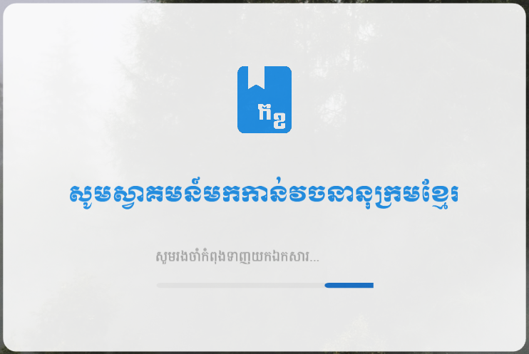
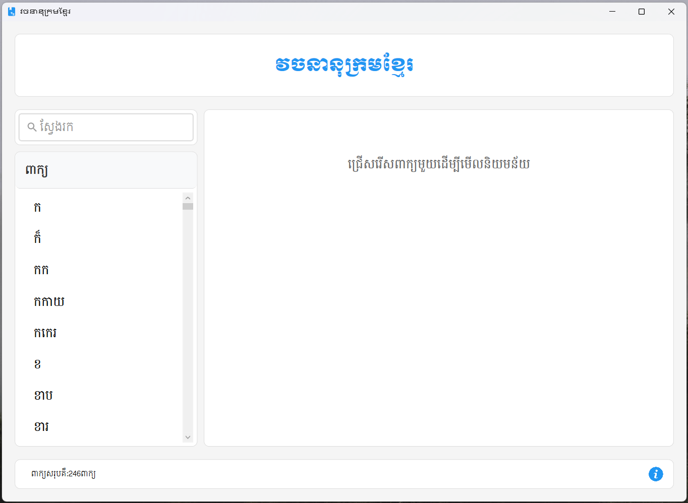
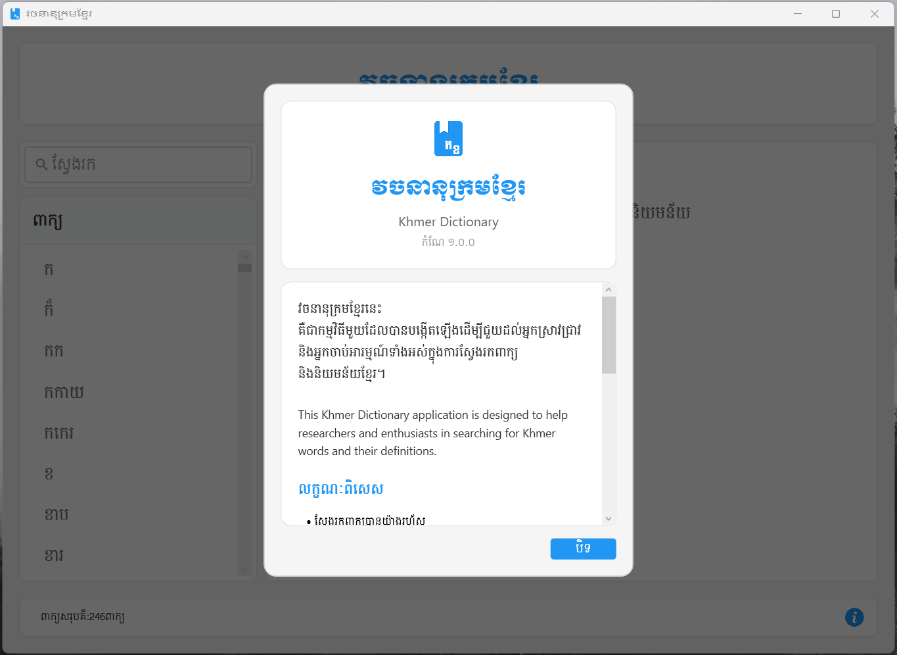

# Khmer Dictionary (វចនានុក្រមខ្មែរ)

<p align="center">
  
</p>

<h2 style="font-family:Khmer OS Battambang;">វចនានុក្រមខ្មែរនេះ គឺជាកម្មវិធីមួយដែលបានបង្កើតឡើងដើម្បីជួយដល់អ្នកស្រាវជ្រាវ និងអ្នកចាប់អារម្មណ៍ទាំងអស់ក្នុងការស្វែងរកពាក្យ និងនិយមន័យខ្មែរ។</h2>

**Khmer Dictionary (វចនានុក្រមខ្មែរ)** is designed to help researchers and enthusiasts in searching for Khmer words and their definitions.

### <h1 style="font-family:Khmer OS Battambang;">ផ្ទាំងស្វាគមន៍</h1>

<p align="center">
  
</p>

### <h1 style="font-family:Khmer OS Battambang;">ផ្ទាំងកម្មវិធី</h1>

<p align="center">
  
</p>

### <h1 style="font-family:Khmer OS Battambang;">ផ្ទាំងអំពីកម្មវិធី</h1>

<p align="center">
  
</p>

## Features

- 🔍 **Search Khmer Words** with real-time results
- 📚 **View Definitions** in clear and concise Khmer
- 💾 **JSON Data Handling** using `Newtonsoft.Json`
- 🎨 **Modern UI** built with WPF (Windows Presentation Foundation)

## Technologies Used

- [.NET Framework / .NET Core](https://dotnet.microsoft.com/)
- [WPF (Windows Presentation Foundation)](https://learn.microsoft.com/en-us/dotnet/desktop/wpf/)
- [Newtonsoft.Json](https://www.newtonsoft.com/json) for JSON parsing

## Getting Started

### Prerequisites

- [.NET SDK](https://dotnet.microsoft.com/download)
- Visual Studio or any compatible IDE

### Clone the Repository

```bash
git clone https://github.com/your-username/khmer-dictionary.git
cd khmer-dictionary
